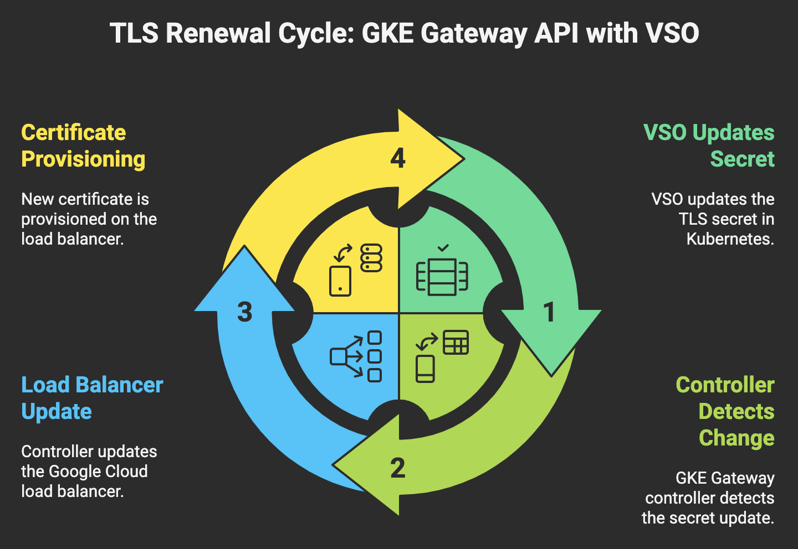

# Vault Secrets Operator (VSO) Integration for GKE Gateway

This document describes the complete setup for integrating GKE Gateway with HashiCorp Vault using the Vault Secrets Operator for automated TLS certificate management in both external and internal load balancing scenarios.

## Overview

This solution provides:
- ✅ **Automated TLS certificate management** from Vault to GKE Gateway
- ✅ **Automatic TLS certificate renewal** when certificates are updated in Vault
- ✅ **Dual gateway architecture** supporting both external and internal access patterns  
- ✅ **Zero-Downtime certificate updates** with 30-second refresh intervals
- ✅ **Multi-service support** with Jenkins and SonarQube configurations
- ✅ **Comprehensive security policies** with restricted TLS configurations
- ✅ **Automated DNS management** for both public and private zones

## Architecture



The VSO-GKE Gateway integration provides **automatic TLS certificate renewal** through a continuous monitoring and synchronization process:

```
Certificate Update/Renewal in Vault
        ↓
VaultStaticSecret (30s refresh monitoring)
        ↓ (Automatic Detection)
Kubernetes TLS Secret Update
        ↓ (Seamless Renewal)
GKE Gateway Certificate Reference
        ↓ (Zero-Downtime Application)
Load Balancer TLS Termination
        ↓
Secure Service Access (Renewed Certificates)
```

## File Structure

```
gateway/
├── configure-gateway-external.sh           # External gateway deployment script
├── configure-gateway-internal.sh           # Internal gateway deployment script  
├── enable-gateway-api.sh                   # Gateway API enablement script
├── external/                               # External gateway configurations
│   ├── jenkins/
│   │   ├── gateway.yaml                    # Jenkins external gateway
│   │   └── gateway-policy.yaml             # Jenkins SSL policy
│   └── sonarqube/
│       ├── gateway.yaml                    # SonarQube external gateway
│       └── gateway-policy.yaml             # SonarQube SSL policy
├── internal/                               # Internal gateway configurations
│   ├── gateway.yaml                        # Unified internal gateway
│   └── gateway-policy.yaml                 # Internal SSL policy
└── vault/                                  # VSO configurations
    ├── vault-dev-secret-syst-2374-jenkins-tls.yaml     # Jenkins certificate sync
    └── vault-dev-secret-syst-2374-sonarqube-tls.yaml   # SonarQube certificate sync
```


### Automatic Renewal Process

**Continuous Monitoring**: VSO continuously polls Vault every 30 seconds to detect certificate changes or renewals.

**Instant Detection**: When certificates are updated or renewed in Vault, VSO immediately detects the changes through HMAC-based change detection.

**Seamless Integration**: Updated certificates are automatically synchronized to Kubernetes TLS secrets without requiring any manual intervention or configuration changes.

**Zero-Downtime Renewal**: GKE Gateway automatically picks up renewed certificates from updated Kubernetes secrets, ensuring services remain available throughout the renewal process.

**End-to-End Automation**: The entire certificate renewal lifecycle from Vault update to active service endpoints happens automatically within 30-40 seconds.

## Components

### 1. Vault Secrets Operator Configuration

**Files**: 
- `vault-dev-secret-syst-2374-jenkins-tls.yaml`
- `vault-dev-secret-syst-2374-sonarqube-tls.yaml`

#### Jenkins TLS Secret Configuration

Key configurations:
- `refreshAfter: "30s"` - Certificate sync interval from Vault enabling automatic renewal detection
- `hmacSecretData: true` - Enables change detection and data integrity for certificate updates
- `vaultAuthRef` - Uses AppRole authentication method for secure Vault access
- `type: "kubernetes.io/tls"` - Creates standard Kubernetes TLS secrets compatible with Gateway API
- Template transformation converts Vault certificate data to TLS format automatically
- Automatic secret creation and overwrite capabilities ensure seamless certificate renewal
- **Continuous monitoring** - VSO continuously monitors Vault for certificate changes and updates

#### SonarQube TLS Secret Configuration

Advanced features:
- **Multi-domain certificate support** - Handles both external and internal domain certificates
- **Conditional templating** - Uses Go template logic to select appropriate certificate based on availability
- **Kubernetes authentication** - Demonstrates alternative authentication method
- **Flexible certificate path resolution** - Supports multiple certificate naming conventions

### 2. Gateway API Configuration

#### External Gateway Architecture

**Files**:
- `external/jenkins/gateway.yaml` and `gateway-policy.yaml`
- `external/sonarqube/gateway.yaml` and `gateway-policy.yaml`

**Jenkins External Gateway Configuration**:
- Gateway class: `gke-l7-global-external-managed` for global external load balancing
- Named address references for static IP consistency
- HTTPS listener on port 443 with TLS termination
- Namespace-based routing controls limiting access to specific service namespaces
- Certificate references point to VSO-managed Kubernetes TLS secrets

**SonarQube External Gateway Configuration**:
- Similar configuration to Jenkins with dedicated static IP address
- Separate gateway instance for service isolation
- Individual SSL policy application for customized security settings

#### Internal Gateway Architecture

**Files**: 
- `internal/gateway.yaml`
- `internal/gateway-policy.yaml`

**Unified Internal Gateway Configuration**:
- Gateway class: `gke-l7-rilb` for regional internal load balancing
- Single gateway serving multiple services (Jenkins and SonarQube)
- Multi-certificate TLS configuration supporting both services
- Namespace selector allowing access from both Jenkins and SonarQube namespaces
- Regional static IP address for internal network access

### 3. SSL/TLS Policy Configuration

#### Global SSL Policy (External Access)
- **Profile**: RESTRICTED for maximum security
- **Minimum TLS Version**: 1.2 for modern security standards
- **Scope**: Global for external load balancers
- Applied via GCPGatewayPolicy resources

#### Regional SSL Policy (Internal Access)  
- **Profile**: RESTRICTED matching external security standards
- **Minimum TLS Version**: 1.2 consistency across environments
- **Scope**: Regional for internal load balancers
- Dedicated policy for internal traffic isolation

## Deployment Process

### Deployment Scripts

#### Gateway API Enablement
**File**: `enable-gateway-api.sh`

Enables Gateway API standard features on the GKE cluster with required controller configurations for both external and internal load balancer support.

#### External Gateway Deployment  
**File**: `configure-gateway-external.sh`

Comprehensive external gateway setup including:
- Network firewall rule creation for health check access
- Global static IP address provisioning for both Jenkins and SonarQube
- Global SSL policy creation with restricted security profile
- VSO configuration deployment for certificate management
- Gateway resource deployment with external load balancer configuration
- DNS record creation in public managed zones

#### Internal Gateway Deployment
**File**: `configure-gateway-internal.sh`

Internal gateway configuration featuring:
- Internal firewall rules for proxy-only subnet health checks
- Regional static IP address provisioning within specified subnet
- Regional SSL policy creation matching external security standards
- Unified internal gateway deployment serving multiple services
- DNS record creation in private managed zones for internal access

## Configuration Details

### Prerequisites
1. **GKE Cluster**: With Gateway API standard configuration enabled
2. **Vault Secrets Operator**: Installed and configured with appropriate authentication
3. **Vault Authentication**: AppRole or Kubernetes auth methods properly configured
4. **Network Infrastructure**: VPC networks, subnets, and basic firewall rules established
5. **DNS Zones**: Managed DNS zones for both public and private domain management
6. **Static IP Reservations**: Available IP ranges for both global and regional allocations

### Deployment Flow

#### 1. Gateway API Enablement
The `enable-gateway-api.sh` script configures the GKE cluster with Gateway API standard features, enabling both external and internal load balancer capabilities.

#### 2. External Gateway Setup
The `configure-gateway-external.sh` script performs comprehensive external gateway configuration:
- **Network Security**: Creates firewall rules allowing Google Load Balancer health check access from standard ranges (35.191.0.0/16, 130.211.0.0/22)
- **IP Management**: Provisions dedicated global static IP addresses for Jenkins and SonarQube services
- **Security Policies**: Establishes global SSL policies with restricted profiles and TLS 1.2 minimum requirements
- **Certificate Integration**: Deploys VSO configurations for automated certificate management
- **Gateway Deployment**: Creates separate external gateways for Jenkins and SonarQube with dedicated configurations
- **DNS Integration**: Automatically creates DNS A records in public managed zones

#### 3. Internal Gateway Setup  
The `configure-gateway-internal.sh` script configures internal network access:
- **Internal Security**: Creates firewall rules for proxy-only subnet health check access
- **Regional Resources**: Provisions regional static IP addresses within designated subnets
- **Policy Alignment**: Creates regional SSL policies matching external security standards
- **Unified Gateway**: Deploys single internal gateway serving both Jenkins and SonarQube
- **Private DNS**: Creates DNS records in private managed zones for internal network resolution

### Network Architecture

#### Firewall Configuration
**External Load Balancer Access:**
- Jenkins health checks: TCP port 8080 from Google Load Balancer ranges
- SonarQube health checks: TCP port 9000 from Google Load Balancer ranges  
- Target tags: Specific GKE node pool identifiers for precise access control

**Internal Load Balancer Access:**
- Health checks from proxy-only subnet range
- Same target tags ensuring consistent node pool access
- Regional scope limiting access to specific geographic region

#### DNS Management Strategy
**Public DNS Configuration:**
- Managed zone
- Jenkins record: `jenkins-clone.prod.example.de`
- SonarQube record: `sonarqube-clone.prod.example.de`
- TTL: 300 seconds for reasonable caching with update flexibility

**Private DNS Configuration:**
- Managed zone
- Jenkins internal record: `jenkins-clone.dev.internal.example.de`
- SonarQube internal record: `sonarqube-clone.dev.internal.example.de`
- Regional internal load balancer IP resolution

## How It Works

### 1. Automatic Certificate Renewal Flow
1. **Vault Certificate Update**: Administrator updates or renews TLS certificates in Vault KV-v2 store
2. **VSO Detection**: VaultStaticSecret resources automatically detect certificate changes via 30-second refresh intervals
3. **Secret Transformation**: VSO applies template transformations converting new Vault certificate data to Kubernetes TLS format
4. **Kubernetes Update**: TLS secrets are automatically created or updated in target namespaces with new certificate data
5. **Gateway Integration**: GKE Gateway automatically references updated secrets for TLS termination without configuration changes
6. **Load Balancer Update**: Google Cloud Load Balancer automatically picks up and applies new certificates without downtime
7. **Service Availability**: Services remain fully available throughout the entire certificate renewal process
8. **Renewal Verification**: Updated certificates are immediately active on all gateway endpoints

### 2. Authentication Flow
**AppRole Method (Jenkins)**:
- VSO authenticates to Vault using AppRole credentials
- Service-to-service authentication suitable for automated systems
- Role-based access controls limit secret access scope

**Kubernetes Method (SonarQube)**:
- VSO uses Kubernetes service account tokens for Vault authentication
- Pod-based authentication leveraging cluster identity
- Integrates with Kubernetes RBAC for access control

### 3. Gateway Operation
**External Gateway Processing**:
- Global external load balancers provide worldwide accessibility
- Separate gateway instances ensure service isolation
- Individual static IP addresses enable specific DNS targeting
- SSL policies enforce security standards at load balancer level

**Internal Gateway Processing**:
- Regional internal load balancers serve private network traffic
- Single gateway instance efficiently handles multiple services
- Shared static IP address with host-based routing
- Regional policies align with external security standards

## Verification and Monitoring

### Certificate Sync and Renewal Status
Monitor VaultStaticSecret resource status for sync health, error conditions, and last successful update timestamps. Check Kubernetes TLS secret creation and content verification through secret inspection commands. **Certificate Renewal Monitoring**: Track automatic certificate renewal events and verify that updated certificates from Vault are successfully synchronized to Gateway resources without manual intervention.

### Gateway Health Monitoring  
Track gateway provisioning status, load balancer readiness, and IP address assignment through kubectl gateway status monitoring. Monitor GCP load balancer creation progress and configuration application.

### DNS Resolution Verification
Verify DNS record creation in both public and private managed zones. Test resolution from different network locations to ensure proper internal and external access patterns.

### Logs and Diagnostics
**VSO Operator Monitoring**: Review vault-secrets-operator deployment logs for authentication issues, sync failures, and certificate processing errors.

**Gateway Controller Monitoring**: Examine gke-system gateway-controller logs for provisioning status, configuration errors, and load balancer integration issues.

**Resource Event Monitoring**: Use kubectl describe commands on gateway and VaultStaticSecret resources to review recent events and status changes.

## Troubleshooting Guide

### VSO Authentication Issues
- Verify Vault authentication method configuration and credentials
- Check service account permissions and role bindings
- Review Vault policy assignments for secret path access
- Validate network connectivity between cluster and Vault instance

### Certificate Synchronization Problems
- Confirm Vault secret path accuracy and data format
- Review template transformation syntax and variable references
- Check refresh interval settings and HMAC configuration
- Verify destination secret naming and namespace targeting

### Gateway Provisioning Delays
- Monitor GCP load balancer creation progress through Cloud Console
- Check firewall rule configuration for health check access
- Verify static IP address allocation and assignment
- Review SSL policy application and compatibility

### DNS Resolution Issues
- Confirm managed zone configuration and record creation
- Test DNS propagation timing and TTL settings
- Verify network-specific DNS resolution for internal zones
- Check DNS record format and target IP accuracy

## Cleanup Process

### External Gateway Cleanup
Both deployment scripts include comprehensive cleanup procedures for complete resource removal:

**Resource Removal Sequence**:
- Delete external gateway configurations for Jenkins and SonarQube
- Remove DNS records from public managed zones  
- Delete global static IP address allocations
- Remove global SSL policies
- Clean up external firewall rules for health check access
- Remove VSO configurations and generated secrets

### Internal Gateway Cleanup
**Internal Resource Cleanup**:
- Delete internal gateway configuration
- Remove DNS records from private managed zones
- Release regional static IP address reservations
- Delete regional SSL policies  
- Clean up internal firewall rules for proxy-only subnet access

### Cleanup Best Practices
Execute cleanup procedures in reverse deployment order to avoid dependency conflicts. Verify DNS record removal before deleting static IP addresses. Monitor GCP resource deletion completion before proceeding with subsequent cleanup steps.

## Key Success Factors

### ✅ What Works
- **Automatic Certificate Renewal**: TLS certificates automatically renew when updated in Vault without manual intervention
- **Rapid Certificate Updates**: 30-second refresh intervals ensure quick detection and application of certificate changes
- **Zero-Downtime Renewal**: Certificate renewal process maintains service availability throughout updates
- **Dual Gateway Architecture**: Supports both public and private access patterns effectively
- **Security Policy Consistency**: Restricted SSL policies maintain high security standards across environments
- **Multi-Service Support**: Single internal gateway efficiently serves multiple applications
- **DNS Integration**: Automated DNS management eliminates manual record maintenance
- **Template Flexibility**: VSO templates handle complex certificate transformation requirements

### ❌ Common Pitfalls
- **Insufficient Firewall Rules**: Missing health check access blocks load balancer functionality
- **Incorrect Certificate Paths**: Wrong Vault paths prevent successful certificate synchronization
- **Authentication Configuration**: Improper Vault auth setup causes VSO sync failures
- **Static IP Conflicts**: IP address conflicts prevent gateway provisioning
- **DNS Zone Mismatches**: Wrong managed zones cause DNS resolution failures
- **Policy Application Delays**: SSL policy application timing can affect initial deployment

## Benefits

1. **Automatic TLS Renewal**: Certificates automatically renew when updated in Vault without manual intervention
2. **Zero-Downtime Updates**: Certificate rotation and renewal without service interruption
3. **Rapid Certificate Deployment**: 30-second detection and deployment of new certificates from Vault
4. **Automated Management**: Minimal manual intervention required for complete certificate lifecycle
5. **Consistent Security**: Standardized SSL policies across all environments with automatic certificate updates
6. **Scalable Architecture**: Support for multiple services and access patterns with unified certificate management
7. **Network Flexibility**: Both public and private access capabilities with seamless certificate renewal
8. **Compliance Ready**: Restricted security profiles meet enterprise requirements with automated certificate updates
9. **Cost Effective**: Shared internal gateway reduces infrastructure costs while maintaining certificate security
10. **Operational Efficiency**: Automated DNS management, IP allocation, and certificate renewal processes

## Environment Information

- **GKE Gateway API**: Standard configuration with external and internal load balancer support
- **Vault Secrets Operator**: Latest version with KV-v2 secret engine support
- **Google Cloud Platform**: Global and regional load balancer capabilities
- **Network Configuration**: Shared VPC with dedicated subnets for different access patterns
- **Security Policies**: Restricted SSL profiles with TLS 1.2 minimum requirements

---

*This setup provides a comprehensive, automated TLS certificate management solution for GKE Gateway with automatic certificate renewal capabilities, supporting both external public access and internal private network patterns without manual intervention.*