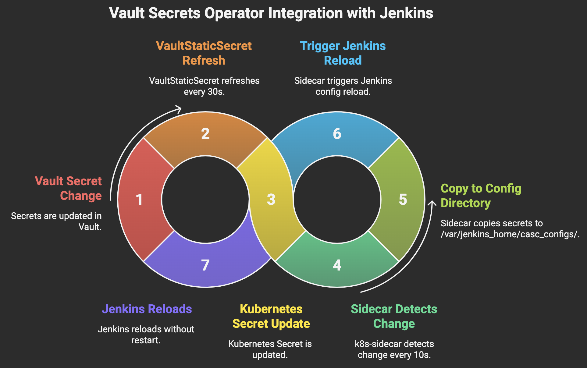

# Jenkins Integration with Vault Secrets Operator and Automatic Config Reload

This document describes the complete setup for integrating Jenkins with HashiCorp Vault using the Vault Secrets Operator, with automatic configuration reload when secrets change - **without pod restarts**.

## Overview

This solution provides:
- ✅ **Seamless secret synchronization** from Vault to Kubernetes secrets
- ✅ **Automatic Jenkins config reload** when secrets change (no pod restarts)
- ✅ **Zero downtime** secret updates
- ✅ **Helm-managed RBAC** (no manual resources)
- ✅ **Fast detection** (30-40 second total delay)

## Architecture



```
Vault Secret Change
        ↓
VaultStaticSecret (30s refresh)
        ↓
Kubernetes Secret Update
        ↓
k8s-sidecar detects change (10s polling)
        ↓
Sidecar copies to /var/jenkins_home/casc_configs/
        ↓
Sidecar triggers Jenkins config reload
        ↓
Jenkins reloads without restart
```

## Components

### 1. VaultStaticSecret Configuration

**File**: `vault-dev-secret-syst-2374-jenkins-creds.yaml`

Key configurations:
- `refreshAfter: "30s"` - Vault sync interval
- `hmacSecretData: true` - Enable change detection
- **Critical**: `rolloutRestartTargets` removed to prevent pod restarts
- **Critical**: Label `nb-clone-jenkins-jenkins-config: "true"` for sidecar detection

```yaml
metadata:
  labels:
    nb-clone-jenkins-jenkins-config: "true"  # Essential for sidecar
spec:
  refreshAfter: "30s"
  hmacSecretData: true
  # rolloutRestartTargets: []  # Removed to prevent pod restarts
```

### 2. Jenkins Helm Configuration

**File**: `saml-override-values.yaml`

#### Key Features:

**A. RBAC Configuration (Helm-managed)**
```yaml
rbac:
  create: true
  readSecrets: true
  # Additional RBAC rules for config-reload sidecar to watch secrets
  additionalRules:
    - apiGroups: [""]
      resources: ["secrets"]
      verbs: ["get", "list", "watch"]
```

**B. Config Auto-Reload Sidecar**
```yaml
sidecars:
  configAutoReload:
    enabled: true
    env:
      # Watch both configmaps and secrets
      - name: RESOURCE
        value: "both"
      # Faster polling (default is 60s)
      - name: SLEEP
        value: "10"
      # Enhanced logging
      - name: LOG_LEVEL
        value: "INFO"
```

**C. Jenkins Configuration as Code (JCasC)**
- **Critical**: All secrets read from `/var/jenkins_home/casc_configs/` (sidecar-managed)
- **NOT** from direct mounts at `/var/jenkins_home/casc-secrets/`

```yaml
credentials:
  system:
    domainCredentials:
    - credentials:
      - string:
          id: "vault-secrets-operator-secret"
          scope: GLOBAL
          secret: "${readFile:/var/jenkins_home/casc_configs/vault-secrets-operator-secret}"
```

### 3. Deployment Script

**File**: `5-configure-jenkins-external.sh`

```bash
helm upgrade --install nb-clone-jenkins jenkins/jenkins \
    --version $JENKINS_HELM_CHART_VERSION \
    -n $JENKINS_NAMESPACE \
    -f saml-override-values.yaml

# No manual RBAC application needed - managed by Helm
```

## How It Works

### 1. Secret Synchronization Flow
1. **Vault Secret Change**: Admin updates secret in Vault
2. **VaultStaticSecret Sync**: VSO syncs change to Kubernetes secret (30s interval)
3. **Kubernetes Secret Update**: Secret `nb-clone-jenkins-credentials` gets updated
4. **Sidecar Detection**: k8s-sidecar detects secret change via Kubernetes API watch
5. **File Copy**: Sidecar copies secret values to `/var/jenkins_home/casc_configs/`
6. **Config Reload**: Sidecar triggers Jenkins reload via HTTP API
7. **Jenkins Updates**: Jenkins reloads configuration without restart

### 2. Sidecar Operation

The k8s-sidecar container:
- **Watches**: Kubernetes secrets with label `nb-clone-jenkins-jenkins-config=true`
- **Polling**: Every 10 seconds (configurable)
- **Target Folder**: `/var/jenkins_home/casc_configs/`
- **Reload Trigger**: `http://localhost:8080/reload-configuration-as-code/?casc-reload-token=<pod-name>`

### 3. RBAC Permissions

Helm automatically creates:
- **Role**: `nb-clone-jenkins-read-secrets` with secret read permissions
- **Role**: `nb-clone-jenkins-casc-reload` with configmap permissions  
- **RoleBindings**: Binding roles to Jenkins service account

## Configuration Details

### Expected Delay
- **Total**: 30-40 seconds from Vault change to Jenkins update
- **VaultStaticSecret refresh**: 30 seconds
- **Sidecar detection**: Up to 10 seconds
- **Jenkins reload**: Immediate

### File Locations
- **Sidecar-managed secrets**: `/var/jenkins_home/casc_configs/`
- **Jenkins reads from**: Same location (no direct mounts)
- **Sidecar watches**: Kubernetes API (not filesystem)

### Labels and Selectors
- **Secret Label**: `nb-clone-jenkins-jenkins-config: "true"`
- **Sidecar Label Selector**: `nb-clone-jenkins-jenkins-config`
- **Namespace**: `ns-nb-clone-jenkins`

## Verification Commands

### Check Secret Sync Status
```bash
# Check VaultStaticSecret status
kubectl get vaultstaticsecret vault-dev-secret-syst-2374-jenkins-creds -n ns-nb-clone-jenkins -o yaml

# Check Kubernetes secret
kubectl get secret nb-clone-jenkins-credentials -n ns-nb-clone-jenkins -o jsonpath='{.data.vault-secrets-operator-secret}' | base64 -d
```

### Check Sidecar Operation
```bash
# Check sidecar logs for activity
kubectl logs nb-clone-jenkins-0 -n ns-nb-clone-jenkins -c config-reload --tail=20

# Check sidecar-managed files
kubectl exec nb-clone-jenkins-0 -n ns-nb-clone-jenkins -c jenkins -- ls -la /var/jenkins_home/casc_configs/

# Check specific secret value
kubectl exec nb-clone-jenkins-0 -n ns-nb-clone-jenkins -c jenkins -- cat /var/jenkins_home/casc_configs/vault-secrets-operator-secret
```

### Check Jenkins Status
```bash
# Check pod status
kubectl get pods -n ns-nb-clone-jenkins

# Check Jenkins logs
kubectl logs nb-clone-jenkins-0 -n ns-nb-clone-jenkins -c jenkins | tail -10
```

### Check RBAC
```bash
# Check helm-managed roles
kubectl describe role nb-clone-jenkins-read-secrets -n ns-nb-clone-jenkins

# Check role bindings
kubectl get rolebinding -n ns-nb-clone-jenkins | grep nb-clone-jenkins
```

## Troubleshooting

### Sidecar Not Detecting Changes
1. **Check secret label**: Ensure `nb-clone-jenkins-jenkins-config: "true"`
2. **Check sidecar logs**: Look for errors or warnings
3. **Verify RBAC**: Ensure secret read permissions exist
4. **Check polling interval**: Default 60s, configured to 10s

### Config Reload Not Working
1. **Check reload endpoint**: Sidecar should POST to reload URL
2. **Check Jenkins logs**: Look for reload activity
3. **Verify file updates**: Check timestamps in `/var/jenkins_home/casc_configs/`
4. **Manual trigger**: Test with `curl -X POST "http://localhost:8080/reload-configuration-as-code/?casc-reload-token=<pod-name>"`

### Secret Not Syncing from Vault
1. **Check VaultStaticSecret status**: Look for errors or sync failures
2. **Verify Vault permissions**: Ensure VSO has access to secret path
3. **Check refresh interval**: Default might be too long
4. **Review VSO logs**: Check vault-secrets-operator pod logs

## Key Success Factors

### ✅ What Works
- **No rolloutRestartTargets**: Prevents unnecessary pod restarts
- **Sidecar-managed files**: Jenkins reads from sidecar-controlled directory
- **Helm-managed RBAC**: No manual resource management
- **Fast polling**: 10-second detection vs default 60s
- **Proper labeling**: Secret labeled for sidecar detection

### ❌ Common Mistakes
- **Direct secret mounts**: Don't mount secrets directly to Jenkins
- **Wrong file paths**: Jenkins must read from `/var/jenkins_home/casc_configs/`
- **Missing labels**: Secret must have correct label for sidecar
- **Manual RBAC**: Don't create separate RBAC resources
- **Pod restart targets**: Remove `rolloutRestartTargets` completely

## Benefits

1. **Zero Downtime**: Secret updates without pod restarts
2. **Fast Updates**: 30-40 second total delay
3. **Automated**: No manual intervention required
4. **Reliable**: Kubernetes-native change detection
5. **Manageable**: Single Helm chart manages everything
6. **Scalable**: Works with any number of secrets
7. **Secure**: Proper RBAC and minimal permissions

## File Structure

```
jenkins/
├── saml-override-values.yaml            # Main Helm values with sidecar config
├── configure-jenkins-external.sh        # Deployment script
├── configure-jenkins-internal.sh        # Deployment script
└── README.md                            # This documentation

vault/
├── vault-dev-secret-syst-2374-jenkins-iap.yaml     # VaultStaticSecret config
└── vault-dev-secret-syst-2374-jenkins-creds.yaml   # VaultStaticSecret config
```

## Version Information

- **Jenkins Helm Chart**: 5.8.86
- **Jenkins Version**: 2.504.1-alpine  
- **k8s-sidecar**: 1.30.7
- **Vault Secrets Operator**: Latest
- **Kubernetes**: GKE cluster

---

*This setup provides a robust, zero-downtime secret management solution for Jenkins with automatic configuration reload capabilities.*
